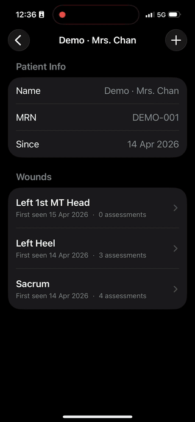

# WoundTrack

On-device **longitudinal wound tracking** for iOS, powered by **YOLO26-seg** (CoreML) for segmentation, **YOLO26-cls** for stage classification, and **ARKit + LiDAR** for real-world cm² area measurement.

WoundTrack lets a clinician record a wound over time on a single iPhone Pro: scan with the camera, get a segmented mask + stage label + measured area in cm², and watch the healing trajectory across visits — entirely on-device, no PHI leaving the phone.

The app started as a stateless single-shot wound detector and pivoted mid-project once the question reframed from *"what is this?"* to *"is it getting better?"*

<p align="center">
  
</p>

---

## Features

- **Longitudinal model** — patients → wounds → assessments stored locally with SwiftData; healing curves charted with Swift Charts
- **On-device inference** — no network round-trips, no PHI leaving the phone
- **Two-stage clinical pipeline** — segmentation (PGIE) followed by per-mask stage classification (SGIE)
- **LiDAR-measured area in cm²** — ARKit `sceneDepth` + camera intrinsics, with plane-fit oblique correction
- **Body-site map picker** — tap a posterior-view diagram to anatomically tag each wound
- **Distance-gated capture** — shutter only enables in the 20–60 cm sweet spot for accurate depth
- **Camera + photo library** input flows for the legacy stateless path
- **Two-row model picker** — Task (General COCO / Wound FUSeg) × Size (N / S / M)

---

## Architecture

```
final-project/
├── WoundTrack/                  # SwiftUI iOS app (xcodegen-driven)
├── model-export/                # uv project: .pt → .mlpackage (CoreML)
└── wound-segmentation-yolo/     # uv project: training scripts (runs on GPU server)
```

The three components are loosely coupled and reflect the real workflow:

1. **`wound-segmentation-yolo/`** trains the segmentation and staging models on a CUDA box. See its [README](wound-segmentation-yolo/README.md).
2. **`model-export/`** turns trained Ultralytics `.pt` checkpoints into CoreML `.mlpackage` files at the right input resolution.
3. **`WoundTrack/`** bundles those `.mlpackage` files as build resources, compiles them to `.mlmodelc` at build time, and runs them on-device via the [`YOLO`](https://github.com/ethanlee928/yolo-ios-app) Swift package.

---

## Bundled models

| Variant | Task | Backbone | Params | Training data | mAP50 / Top-1 | Size |
|---|---|---|---|---|---|---|
| `yolo26n-seg` | General | YOLO26-N | 3.0 M | COCO | — (baseline) | ~5 MB |
| `yolo26s-seg` | General | YOLO26-S | 11.4 M | COCO | — (baseline) | ~20 MB |
| `yolo26m-seg` | General | YOLO26-M | 27.0 M | COCO | — (baseline) | ~50 MB |
| **`wound-yolo26n-seg`** | **Wound seg (PGIE)** | YOLO26-N | 3.0 M | AZH/FUSeg | **mAP50 0.896** | ~5 MB |
| **`wound-yolo26s-seg`** | **Wound seg (PGIE)** | YOLO26-S | 11.4 M | AZH/FUSeg | **mAP50 0.897** | ~20 MB |
| **`wound-stage-yolo26n-cls`** | **PI staging (SGIE)** | YOLO26-N-cls | — | Roboflow PI-staging | **Top-1 ~75.8%** | ~5 MB |

The wound-seg models are fine-tuned on [AZH FUSeg](https://fusc.grand-challenge.org/) (810 train + 200 val, single-class). The medium variant was trained but discarded — it overfit on the small dataset (mAP50 0.872, lower than nano/small) and runs slower. *Smaller wins on small medical datasets* is itself a useful finding.

The PI staging classifier is a placeholder slot, intended to be swapped for a DFUC-2021 infection/ischaemia classifier when dataset access lands.

---

## Project structure

```
WoundTrack/
├── project.yml                          # xcodegen source of truth
├── Info.plist                           # camera/photo library/AR usage strings
├── Resources/
│   ├── *.mlpackage                      # CoreML models (gitignored)
│   └── Assets.xcassets/                 # app icon
├── Sources/
│   ├── WoundTrackApp.swift              # @main, SwiftData container
│   ├── ContentView.swift                # entry — patient list
│   ├── DetectionViewModel.swift         # model loading + inference orchestration
│   ├── StageClassifier.swift            # SGIE wrapper (per-mask cls)
│   ├── ModelVariant.swift               # 5-case enum, Task × Size
│   ├── ModelPickerView.swift            # two-row segmented picker
│   ├── WoundStage.swift                 # NPIAP staging enum
│   ├── WoundInfoPanel.swift             # detection result list
│   ├── ImagePicker.swift                # UIImagePickerController wrapper
│   ├── PhotoLibraryPicker.swift         # PHPickerViewController wrapper
│   ├── ShareSheet.swift                 # UIActivityViewController wrapper
│   ├── SeedData.swift                   # idempotent first-launch demo data
│   ├── Models/                          # SwiftData layer
│   │   ├── Patient.swift, Wound.swift, Assessment.swift, BodySite.swift
│   │   ├── WoundStore.swift             # @ModelActor for off-main writes
│   │   └── FileCleanup.swift            # remove image files on cascade delete
│   ├── Capture/                         # AR + measurement
│   │   ├── ARCaptureView.swift          # ARSession + sceneDepth + shutter gate
│   │   ├── ARCapturedFrame.swift
│   │   ├── AreaCalculator.swift         # cm² from depth + mask + intrinsics
│   │   ├── BooleanMask+CGImage.swift    # rasterize YOLO mask to capture res
│   │   └── CaptureInferenceResult.swift
│   └── Views/                           # SwiftUI screens
│       ├── PatientListView.swift, PatientDetailView.swift
│       ├── WoundDetailView.swift        # area-over-time chart + assessment list
│       ├── AssessmentDetailView.swift
│       ├── CaptureFlowView.swift        # capturing → processing → review
│       └── BodySitePicker.swift         # posterior-view body diagram
├── Tests/                               # XCTest
│   ├── WoundStageTests.swift, AreaCalculatorTests.swift, PersistenceTests.swift
└── scripts/
    └── fix-mlpackage-buildphase.py      # post-process generated pbxproj

model-export/
├── pyproject.toml                       # uv project, ultralytics + coremltools
├── uv.lock
└── main.py

wound-segmentation-yolo/
├── pyproject.toml, uv.lock, dataset.yaml
└── scripts/                             # training + dataset prep
```

---

## Setup

### Prerequisites

- macOS with Xcode 16+
- An **iPhone Pro** with LiDAR for on-device testing (CoreML + ARKit don't run in the simulator for this app)
- [`xcodegen`](https://github.com/yonaskolb/XcodeGen) (`brew install xcodegen`)
- [`uv`](https://github.com/astral-sh/uv) (`brew install uv`)

### Recover the model artifacts

The `.pt` and `.mlpackage` files are intentionally not in git. The fastest path is to grab the prebuilt CoreML bundles from the [v1.0.0 release](https://github.com/ethanlee928/wound-track-ios/releases/tag/v1.0.0):

```bash
curl -L -o /tmp/wt-models.zip \
  https://github.com/ethanlee928/wound-track-ios/releases/download/v1.0.0/wound-track-models-v1.0.0.zip
unzip /tmp/wt-models.zip -d WoundTrack/Resources/
```

This drops in all 7 `.mlpackage` directories the app expects — 3 COCO baselines, 2 FUSeg-fine-tuned wound-segmentation models, and 2 PI-staging classifiers. Filenames must match `WoundTrack/Sources/Inference/ModelVariant.swift` exactly, so don't rename anything inside the zip.

#### Re-export from source checkpoints (optional)

If you want to re-export at a different `imgsz` or audit the weights, the same release ships the fine-tuned `.pt` source checkpoints:

```bash
curl -L -o /tmp/wt-checkpoints.zip \
  https://github.com/ethanlee928/wound-track-ios/releases/download/v1.0.0/wound-track-checkpoints-v1.0.0.zip
unzip /tmp/wt-checkpoints.zip -d model-export/

cd model-export
uv sync

# COCO baselines — Ultralytics auto-downloads the .pt on first run
uv run yolo export model=yolo26n-seg.pt format=coreml imgsz=640
uv run yolo export model=yolo26s-seg.pt format=coreml imgsz=640
uv run yolo export model=yolo26m-seg.pt format=coreml imgsz=640

# Wound-fine-tuned models — exported at the native FUSeg resolution
uv run yolo export model=wound-yolo26n-seg.pt format=coreml imgsz=512 nms=False
uv run yolo export model=wound-yolo26s-seg.pt format=coreml imgsz=512 nms=False

# Stage classifier (SGIE) — exported at YOLO26-cls native size
uv run yolo export model=wound-stage-yolo26n-cls.pt format=coreml imgsz=224

cp -R *.mlpackage ../WoundTrack/Resources/
```

For training the wound-specific models from scratch, see [`wound-segmentation-yolo/README.md`](wound-segmentation-yolo/README.md).

### Build the iOS app

```bash
cd WoundTrack
xcodegen generate
python3 scripts/fix-mlpackage-buildphase.py
open WoundTrack.xcodeproj
```

In Xcode, set your development team under **Signing & Capabilities**, then build and run on a connected iPhone Pro.

---

## How the pieces fit at runtime

```
┌──────────────────────────────────────────────────────────────────┐
│  ARCaptureView (ARSession + .sceneDepth)                         │
│    ↓ ARCapturedFrame { image, depth, confidence, intrinsics }    │
│  CaptureFlowView                                                  │
│    ├─ DetectionViewModel.inferForCapture()                        │
│    │     ├─ PGIE: wound-seg → mask + bbox + score                 │
│    │     └─ SGIE: stage cls on padded crop → stage + confidence   │
│    ├─ BooleanMask.from(cgImage:targetSize:) → mask at capture res │
│    └─ AreaCalculator.measure() → cm² + tilt angle + valid pixels  │
│       └─ Σ (d/fx)(d/fy) on mask pixels, scaled by 1/cos(θ) from   │
│          a least-squares plane fit z = aX + bY + c                │
│           ↓ Assessment(image, mask, area, stage, notes)            │
│  SwiftData (Patient ▸ Wound ▸ Assessment, all on main context)    │
│    ↓ @Bindable + @Query                                            │
│  WoundDetailView → Swift Charts area-over-time + assessment list  │
└──────────────────────────────────────────────────────────────────┘
```

---

## Key technical decisions

These are the decisions worth remembering for the report:

### 1. LiDAR + intrinsics + mask for cm² (not ArUco markers, not monocular)

ARKit on iPhone Pro exposes a 256×192 `sceneDepth` map with per-pixel confidence, plus the camera intrinsic matrix. For each masked pixel at depth `d` we compute its physical area via the pinhole identity:

```
area_pixel = (d / fx) · (d / fy)
```

Summed across the mask and scaled by `1 / cos(θ)` from a least-squares plane fit `z = aX + bY + c`, this gives an oblique-corrected cm² in one shot — no fiducials, no manual scale references. NaN/zero depths and low-confidence pixels are skipped.

### 2. Coordinate-space discipline

YOLO returns boxes in **capture image space** (~1920×1440) and masks at **model input size** (~640×640). Mixing the two crashes with a `Range requires lowerBound <= upperBound`. Fix: rasterize the mask to capture resolution before intersecting with the box, and guard against inverted ranges in `BooleanMask.intersected(with:)`.

Same theme on display: the AR preview uses `.resizeAspectFill` by default, which crops the 4:3 sensor frame into a portrait screen and makes the live view feel zoomed-in vs the post-capture review. Switching to `.resizeAspect` (letterbox) gives a WYSIWYG preview.

And on storage: keep depth + mask + intrinsics in **landscape-native frame** for inference math, and rotate **only at save/display** so timeline thumbnails read upright without breaking the area calculation.

### 3. SwiftData: same-context mutations

The view layer uses `@Query` and `@Bindable`. Writes from a separate `@ModelActor` context don't propagate to those caches — relationships in the main context end up with stale or invalidated `PersistentIdentifier`s, and the next render crashes with *"This model instance was invalidated…"*.

**Rule:** if a view has `@Bindable` or `@Query` on the thing you're mutating, mutate on the same `modelContext`. This applies to inserts, deletes, *and* cascade deletes. The `WoundStore` actor is kept for off-main bulk work but is no longer used from delete/insert paths in the UI.

### 4. Native 512×512 inference for wound models

FUSeg ships uniformly at 512×512. Training and export both use `imgsz=512`, which:

- Avoids any resize during inference
- Keeps the model input shape divisible by the YOLO stride (32)
- Reduces inference cost ~1.5× vs the default 640
- Yields a smaller, faster, more accurate on-device model

The Swift `YOLO` package reads input shape from CoreML metadata, so no app code changes are needed when switching between 512 and 640.

### 5. xcodegen + post-process script for `.mlpackage`

`xcodegen` treats `.mlpackage` as a generic folder reference and puts it in **Resources**. That's wrong — Xcode just copies the folder verbatim instead of compiling it to `.mlmodelc`. **`scripts/fix-mlpackage-buildphase.py`** runs after `xcodegen generate` and patches the generated `pbxproj` to:

- Set `lastKnownFileType = folder.mlpackage` so Xcode recognises CoreML
- Move the `PBXBuildFile` references from `PBXResourcesBuildPhase` to `PBXSourcesBuildPhase` so they compile at build time

This is the only step in the build pipeline not expressible in `project.yml`.

### 6. EXIF orientation normalization

Camera photos on iOS carry an `imageOrientation` field (often `.right` for portrait shots). UIKit respects it for display, but Vision/CoreML processes the raw pixel buffer and ignores the metadata — the model sees a sideways image. `UIImage.normalizedOrientation()` re-draws to `.up` orientation, baking rotation into the pixel data before inference.

### 7. CoreML export environment pinning

A clean install of `coremltools 9.0` produces `TypeError: only 0-dimensional arrays can be converted to Python scalars` during YOLO export — [apple/coremltools#2633](https://github.com/apple/coremltools/issues/2633). The fix is to pin in `pyproject.toml`:

```toml
"torch>=2.7.0,<2.8.0",            # coremltools 9.0 only supports torch ≤ 2.7
"torchvision>=0.22.0,<0.23.0",
"numpy<2.4.0",                    # numpy 2.4+ broke array→scalar coercion
```

### 8. Ultralytics `device=` overrides `CUDA_VISIBLE_DEVICES`

When launching parallel training runs, the obvious approach is to set `os.environ["CUDA_VISIBLE_DEVICES"] = "2"` then pass `device=0` to ultralytics. **This silently fails**: `select_device()` overwrites `CUDA_VISIBLE_DEVICES` with whatever you pass in `device=`, so two parallel runs both end up on physical GPU 0. Fix: don't touch `CUDA_VISIBLE_DEVICES` in code, pass the physical device id directly (`device=2`).

### 9. YOLO26 NMS-free format auto-detection

YOLO26's headline architecture change is **end-to-end NMS** baked into the model graph. Exporting wound-seg with `nms=False` keeps post-NMS in the Swift package; the [`yolo-ios-app`](https://github.com/ethanlee928/yolo-ios-app) fork auto-detects from CoreML metadata (`userDefined["nms"]`) and adapts. So switching from YOLOv8 to YOLO26 required **zero Swift code changes**.

### 10. Strong reference during async model load

The `YOLO` initializer returns synchronously but compiles on a background thread, calling a completion handler. Inside that handler, `[weak self]` means the `YOLO` instance has nothing else holding it alive — and gets deallocated mid-compile, silently failing to load. Store the returned instance into `self.model` *before* the completion fires:

```swift
let yolo = YOLO(variant.rawValue, task: .segment) { [weak self] result in ... }
self.model = yolo  // strong ref keeps it alive through async compilation
```

---

## Status & limitations

- **Demonstrates feasibility** of on-device longitudinal tracking with depth-measured area on a consumer iPhone Pro. **Not clinically deployable** — no IRB, no clinical validation.
- The cm² accuracy claim still needs a calibration experiment: printed circular targets at 20/25/30 cm × 0°/30°/45° tilt to defend the ±5% number.
- The PI staging classifier is a placeholder; the slot is reserved for a DFUC-2021 infection/ischaemia model.
- Auto wound re-identification across visits is manual today (the clinician picks which wound the assessment belongs to).

---

## Credits

- **Models**: [Ultralytics YOLO26](https://docs.ultralytics.com/models/yolo26/) (segmentation + classification variants)
- **iOS Swift package**: forked from [`ultralytics/yolo-ios-app`](https://github.com/ultralytics/yolo-ios-app) → [`ethanlee928/yolo-ios-app`](https://github.com/ethanlee928/yolo-ios-app)
- **Wound dataset**: [AZH FUSeg](https://fusc.grand-challenge.org/) — Wang et al., *Fully automatic wound segmentation with deep convolutional neural networks*, Scientific Reports 10, 21897 (2020)
- **Build tooling**: [`xcodegen`](https://github.com/yonaskolb/XcodeGen), [`uv`](https://github.com/astral-sh/uv)
